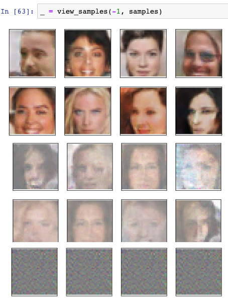

# Face-Generator-GAN
A Deep Convolutional GAN that generates faces. Created for Udacity Deep Learning Nanodegree with Ian Goodfellow, creator of the original GAN.

## Project Description
Using a dataset [CalebA](http://mmlab.ie.cuhk.edu.hk/projects/CelebA.html) with more than 200K celebrities cropped face images 32x32 size, we created a DCGAN in Pytorch on a Jupyter notebook trained on GPU. 

## The GAN Model
GANs are made from a Generator who tries to "fake" an image from scratch and a Discriminator who after training on identifying the celebs images, tries to determine if the new generated image is fake. Each round/epoch, the two opposing sides improve. "The Faker" and "The Fake Detector".  Both generator and discriminator are made of 4 convolutional layers and one fully connected one. I used and even sized kernel but it is recommended to use odd size and even bigger amount of hidden layes than what I used.

## The Results
After 20 epochs, I managed to get realistic results of faces that never existed a few hours ago. For me it is mindblowing

In the image - the most bottom row displays the image at the earliest stage. No more than just randomized RGB noise.
The two rows in the middle which looks like impressionist art is several attempts I had which the loss was not calculated right. The first two rows are the results I got after setting the network as it is in the attached files.

Thanks a lot for Udacity. It was an amazing online platform to study
And if fellow students are reading, I would really suggest not to copy-paste this project but learn from it if it helps
